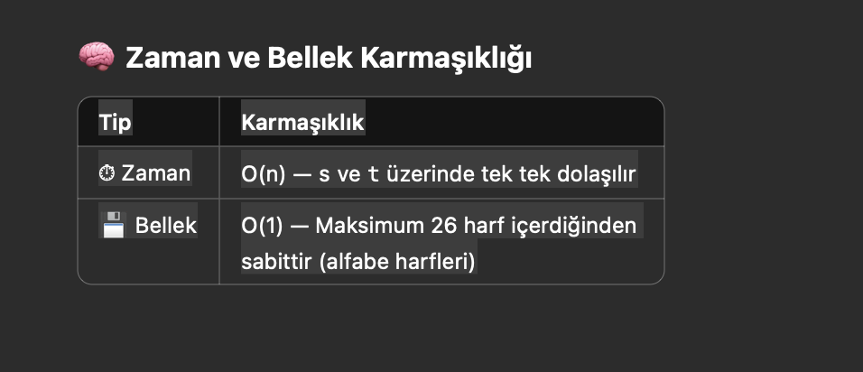

# 🧠 LeetCode - Q02: Valid Anagram

## 📌 Soru Açıklaması

İki string (`s` ve `t`) verilir. Görevimiz, `t` stringinin `s` stringinin **anagramı** olup olmadığını belirlemektir.

🔁 **Anagram nedir?**  
Anagram, harflerin sıralaması farklı olsa da karakterleri ve karakter sayıları aynı olan iki kelimedir.  
Örneğin: `"listen"` ve `"silent"` birbirinin anagramıdır.

---

## ✅ Girdi / Çıktı

### 🔸 Girdi:
- `s = "anagram"`
- `t = "nagaram"`

### 🔸 Çıktı:
- `true`

---

## 💡 Çözüm Stratejisi

1. **Uzunluk kontrolü:**  
   İki stringin uzunlukları eşit değilse anagram olmaları mümkün değildir.

2. **Harf sayımı:**  
   `s` stringindeki her harfi bir `Map<Character, Integer>` yapısında sayarız.

3. **Azaltma:**  
   `t` stringindeki harfleri sırayla kontrol ederiz. Her harfin karşılığını map'ten bir azaltırız.
    - Eğer bir harf map'te yoksa veya sayım sıfırın altına inerse `false` döneriz.

4. **Tüm kontroller başarılıysa:**  
   `true` döneriz çünkü her iki string de aynı karakterleri içeriyor demektir. 
___ 


---

## 🧪 Örnek Kod

```java
public boolean isAnagram(String s, String t) {
    if (s.length() != t.length()) {
        return false;
    }

    Map<Character, Integer> countMap = new HashMap<>();

    for (char c : s.toCharArray()) {
        countMap.put(c, countMap.getOrDefault(c, 0) + 1);
    }

    for (char c : t.toCharArray()) {
        if (!countMap.containsKey(c)) {
            return false;
        }

        countMap.put(c, countMap.get(c) - 1);
        if (countMap.get(c) < 0) {
            return false;
        }
    }
    return true;
} 
```
  
___ 
## 🔍 Alternatif Yaklaşım
### •	Karakter dizilerini sıralayıp karşılaştırmak:
### Arrays.sort(s.toCharArray()) ve Arrays.sort(t.toCharArray()) yaparak karşılaştırılabilir.
### Ancak bu yöntem O(n log n) zaman karmaşıklığına sahiptir.  

___ 
## 🧰 Kullanılan Yapılar
### •	Map (Java HashMap)
### •	getOrDefault()
### •	for-each döngüsü
### •	char[] dönüşümü

___ 
## 🛠 Technologies Used

### - Java 17
### - IntelliJ IDEA
### - Git & GitHub

